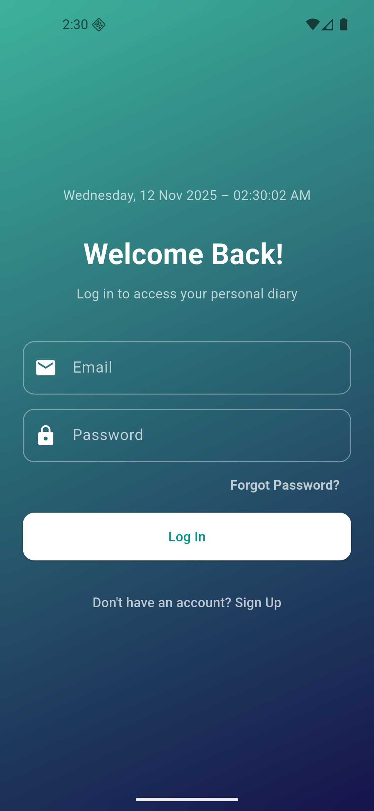
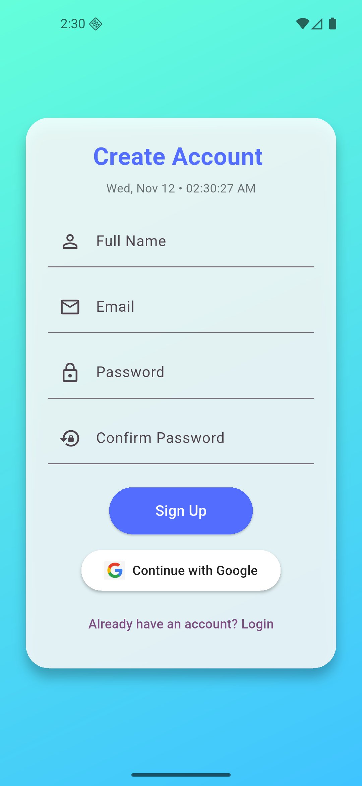
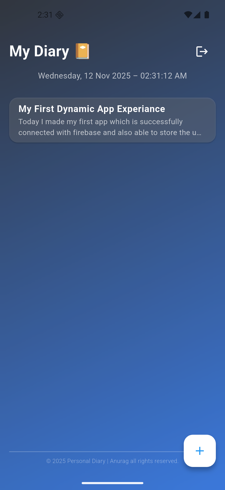
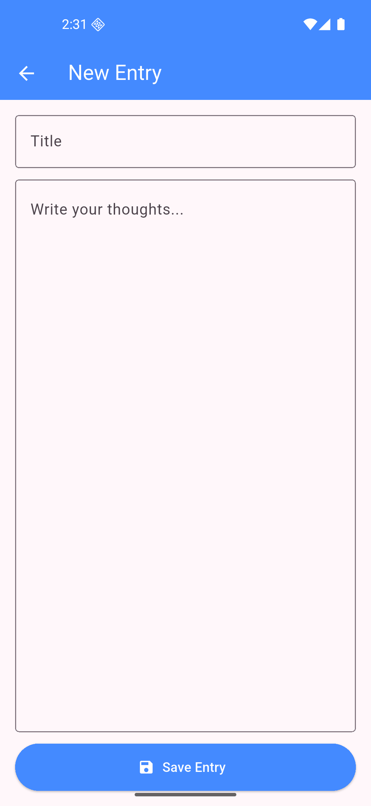

#  My personal diary App

A modern and animated **Login & Signup Flutter application** with Firebase integration and custom launcher icons.  
This app includes elegant UI animations, real-time authentication, and smooth transitions for a delightful user experience.

---

##  Features

-  Beautiful animated UI (built with `animate_do`)
-  Firebase Authentication (Login / Signup)
-  Firestore database integration
-  Google Sign-In support
-  Real-time data and date/time updates

---

##  Tech Stack

- **Framework:** Flutter  
- **Backend:** Firebase (Auth + Firestore)  
- **Language:** Dart  
- **Packages Used:**
  - `firebase_core`
  - `firebase_auth`
  - `cloud_firestore`
  - `google_sign_in`
  - `animate_do`
  - `intl`

---

##  Screenshots

| Login Page | Signup Page |
|-------------|-------------|
|  |  |

| Home Page | Firebase Integration |
|------------|---------------------|
|  |  |

---

##  How to Run

1. **Clone this repository**
   
   git clone https://github.com/Anuragzha/Personal-Diary

## Next
2. **Navigate into the project**
   
   cd login_signup
3. **Install dependencies**
   flutter pub get
4.**Then**
   flutter run
